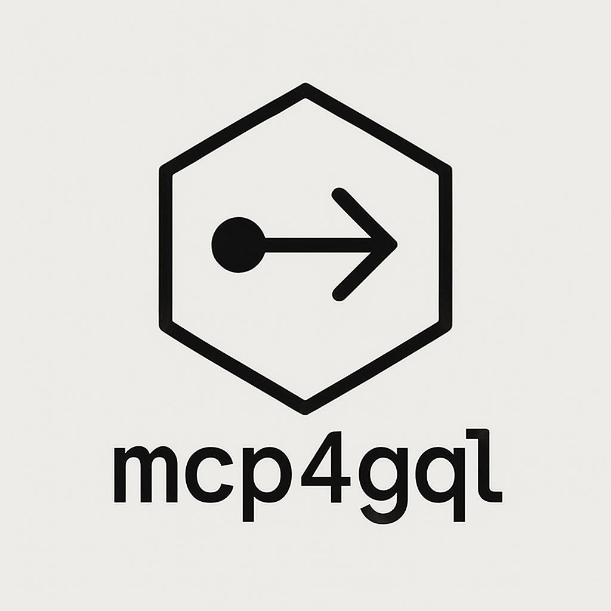

[](https://mseep.ai/app/jorgeraad-mcp4gql)

# mcp4gql - GraphQL MCP Server

[](https://smithery.ai/server/@jorgeraad/mcp4gql)



This project is a Node.js/TypeScript server that implements the Model Context Protocol (MCP). It acts as a bridge, allowing MCP clients (like Cursor) to interact with a target GraphQL API.

## Features

- **MCP Server:** Implements the MCP `Server` class from `@modelcontextprotocol/sdk`.
- **Stdio Transport:** Communicates with clients via standard input/output.
- **GraphQL Client:** Uses `axios` to send requests to the configured GraphQL endpoint.
- **Generic GraphQL Tools:** Exposes the following tools to MCP clients:
  - `introspectGraphQLSchema`: Fetches the target GraphQL API schema using introspection.
  - `executeGraphQLOperation`: Executes arbitrary GraphQL queries or mutations against the target API, taking `query`, optional `variables`, and optional `operationName` as input.

## Configuration

The server requires the following environment variables:

- `GRAPHQL_ENDPOINT`: The URL of the target GraphQL API.
- `AUTH_TOKEN`: A bearer token for an optional `Authorization: Bearer <token>` header for authenticating with the GraphQL API.

## Client Configuration

To allow clients like Cursor or Claude Desktop to use the tools provided by this server, you need to configure them to run the `npx` command.

### Cursor

1. Go to Cursor MCP Settings (Cursor > Settings > Cursor Settings > MCP)
2. Go to + Add new global MCP server
3. Add the following to your Cursor MCP configuration:

   ```json
   {
     "mcpServers": {
       "mcp4gql": {
         "command": "npx",
         "type": "stdio",
         "args": ["-y", "mcp4gql"],
         "env": {
           "GRAPHQL_ENDPOINT": "YOUR_GRAPHQL_ENDPOINT_URL",
           "AUTH_TOKEN": "YOUR_OPTIONAL_AUTH_TOKEN"
         }
       }
     }
   }
   ```

### Claude Desktop

1.  Open Claude Desktop settings (Claude > Settings).
2.  Go to Developer > Edit Config.
3.  Add to the config:

    ```json
    {
      "mcpServers": {
        "mcp4gql": {
          "command": "npx",
          "args": ["-y", "mcp4gql"],
          "env": {
            "GRAPHQL_ENDPOINT": "YOUR_GRAPHQL_ENDPOINT_URL",
            "AUTH_TOKEN": "YOUR_OPTIONAL_AUTH_TOKEN"
          }
        }
      }
    }
    ```

Once configured, the MCP client should be able to list and call the `introspectGraphQLSchema` and `executeGraphQLOperation` tools provided by this server when relevant. Remember to set the required environment variables (`GRAPHQL_ENDPOINT` and optionally `AUTH_TOKEN`) in the configuration so the server can connect to your API.
